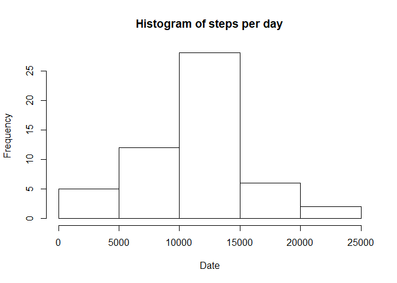
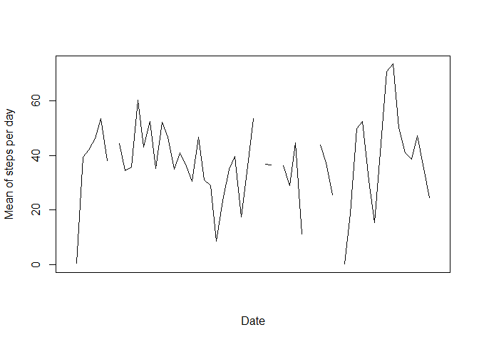
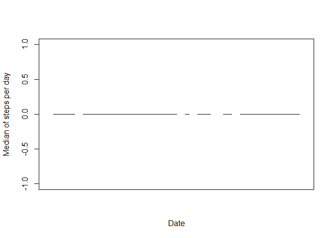
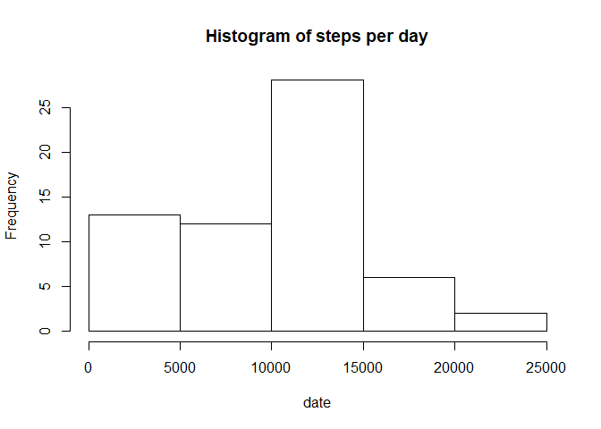
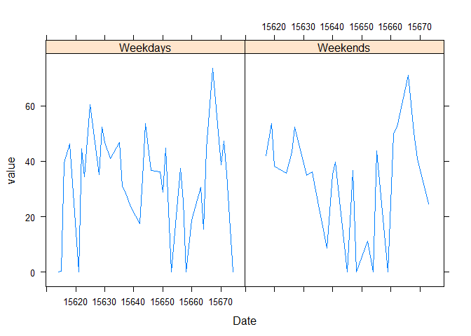

1 Read data set

```r
library(lubridate)
```

```
## Warning: package 'lubridate' was built under R version 3.5.3
```

```
## 
## Attaching package: 'lubridate'
```

```
## The following objects are masked from 'package:base':
## 
##     date, intersect, setdiff, union
```

```r
Dset<-read.csv('activity.csv',na.strings = 'NA')
Dset$date<-ymd(Dset$date)
```


2 Histogram of the total steps per day

```r
StepDay<-tapply(Dset$steps,Dset$date,sum )
hist(StepDay,xlab='Date',main = 'Histogram of steps per day')
```

<!-- -->
3 Mean and median of the total steps per day

```r
tapply(Dset$steps,Dset$date,mean)
```

```
## 2012-10-01 2012-10-02 2012-10-03 2012-10-04 2012-10-05 2012-10-06 2012-10-07 
##         NA  0.4375000 39.4166667 42.0694444 46.1597222 53.5416667 38.2465278 
## 2012-10-08 2012-10-09 2012-10-10 2012-10-11 2012-10-12 2012-10-13 2012-10-14 
##         NA 44.4826389 34.3750000 35.7777778 60.3541667 43.1458333 52.4236111 
## 2012-10-15 2012-10-16 2012-10-17 2012-10-18 2012-10-19 2012-10-20 2012-10-21 
## 35.2048611 52.3750000 46.7083333 34.9166667 41.0729167 36.0937500 30.6284722 
## 2012-10-22 2012-10-23 2012-10-24 2012-10-25 2012-10-26 2012-10-27 2012-10-28 
## 46.7361111 30.9652778 29.0104167  8.6527778 23.5347222 35.1354167 39.7847222 
## 2012-10-29 2012-10-30 2012-10-31 2012-11-01 2012-11-02 2012-11-03 2012-11-04 
## 17.4236111 34.0937500 53.5208333         NA 36.8055556 36.7048611         NA 
## 2012-11-05 2012-11-06 2012-11-07 2012-11-08 2012-11-09 2012-11-10 2012-11-11 
## 36.2465278 28.9375000 44.7326389 11.1770833         NA         NA 43.7777778 
## 2012-11-12 2012-11-13 2012-11-14 2012-11-15 2012-11-16 2012-11-17 2012-11-18 
## 37.3784722 25.4722222         NA  0.1423611 18.8923611 49.7881944 52.4652778 
## 2012-11-19 2012-11-20 2012-11-21 2012-11-22 2012-11-23 2012-11-24 2012-11-25 
## 30.6979167 15.5277778 44.3993056 70.9270833 73.5902778 50.2708333 41.0902778 
## 2012-11-26 2012-11-27 2012-11-28 2012-11-29 2012-11-30 
## 38.7569444 47.3819444 35.3576389 24.4687500         NA
```

```r
tapply(Dset$steps,Dset$date,median)
```

```
## 2012-10-01 2012-10-02 2012-10-03 2012-10-04 2012-10-05 2012-10-06 2012-10-07 
##         NA          0          0          0          0          0          0 
## 2012-10-08 2012-10-09 2012-10-10 2012-10-11 2012-10-12 2012-10-13 2012-10-14 
##         NA          0          0          0          0          0          0 
## 2012-10-15 2012-10-16 2012-10-17 2012-10-18 2012-10-19 2012-10-20 2012-10-21 
##          0          0          0          0          0          0          0 
## 2012-10-22 2012-10-23 2012-10-24 2012-10-25 2012-10-26 2012-10-27 2012-10-28 
##          0          0          0          0          0          0          0 
## 2012-10-29 2012-10-30 2012-10-31 2012-11-01 2012-11-02 2012-11-03 2012-11-04 
##          0          0          0         NA          0          0         NA 
## 2012-11-05 2012-11-06 2012-11-07 2012-11-08 2012-11-09 2012-11-10 2012-11-11 
##          0          0          0          0         NA         NA          0 
## 2012-11-12 2012-11-13 2012-11-14 2012-11-15 2012-11-16 2012-11-17 2012-11-18 
##          0          0         NA          0          0          0          0 
## 2012-11-19 2012-11-20 2012-11-21 2012-11-22 2012-11-23 2012-11-24 2012-11-25 
##          0          0          0          0          0          0          0 
## 2012-11-26 2012-11-27 2012-11-28 2012-11-29 2012-11-30 
##          0          0          0          0         NA
```

4 Time series plot of the average number of steps taken

```r
library(reshape2)
```

```
## Warning: package 'reshape2' was built under R version 3.5.3
```

```r
StepDayMean<-melt(tapply(Dset$steps,Dset$date,mean))
StepDayMedian<-melt(tapply(Dset$steps,Dset$date,median))
plot(x=as.numeric(ymd(StepDayMean[,1])),y=StepDayMean[,2],type='l',
     xlab='Date',ylab = 'Mean of steps per day',xaxt='n')
```

<!-- -->

```r
plot(x=as.numeric(ymd(StepDayMedian[,1])),y=StepDayMedian[,2],type='l',
     xlab='Date',ylab = 'Median of steps per day',xaxt='n')
```

<!-- -->

5 The 5-minute interval that, on average, contains the maximum number of steps

```r
DsetNArm<-subset(Dset, !is.na(Dset$steps))
DsetNArm$interval[DsetNArm$steps==max(DsetNArm$steps)]
```

```
## [1] 615
```

6 Code to describe and show a strategy for imputing missing data


```r
NAs<-which(is.na(Dset$steps))
Dset$steps[NAs]<-0
```

7 Histogram of the total number of steps taken each day after missing values are imputed


```r
hist(tapply(Dset$steps,Dset$date,sum),xlab = 'date',main = 'Histogram of steps per day')
```

<!-- -->

8 Panel plot comparing the average number of steps taken per 5-minute 
interval across weekdays and weekends


```r
library(lattice)
```

```
## Warning: package 'lattice' was built under R version 3.5.3
```

```r
Wds2<-wday(Dset$date)
Wds3<-NA
length(Wds3)<-length(Wds2)
Wds3[Wds2==2|Wds2==3|Wds2==4|Wds2==4|Wds2==6]<-'Weekdays'
Wds3[is.na(Wds3)]<-'Weekends'
Dset<-cbind(Dset,Wds3)
WdDate<-paste(Dset$Wds3,Dset$date)
Dset3<-cbind(Dset,WdDate)
Data8<-melt(tapply(Dset3$steps,Dset3$WdDate,mean))
Data8week<-unlist(strsplit(as.character(Data8$Var1), ' '))[seq(1,length(Data8$Var1)*2,by=2)]
Data8Date<-unlist(strsplit(as.character(Data8$Var1), ' '))[seq(2,length(Data8$Var1)*2,by=2)]
Data8Date<-ymd(Data8Date)
Data82<-cbind(Data8,Data8week,Data8Date)
xyplot(value~as.numeric(Data8Date)|Data8week,data=Data82, type='l',xlab='Date')
```

<!-- -->
